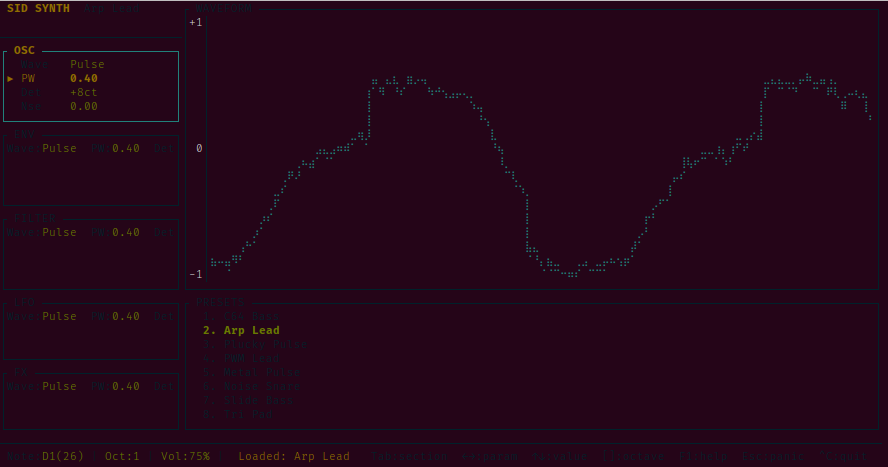

# synth

[](https://github.com/sunsided/synth/actions/workflows/test.yml)
[](https://github.com/sunsided/synth/actions/workflows/format.yml)
[](https://github.com/sunsided/synth/actions/workflows/fuzz-check.yml)

A terminal-based polyphonic synthesizer written in Rust. Play notes with your keyboard, shape the sound with a real-time parameter editor.



## Features

- **Two-octave keyboard layout** mapped to the `Z`/`Q` rows for chromatic note input
- **Five waveforms:** Pulse, Sawtooth, Triangle, Noise, Pulse+Saw
- **ADSR amplitude envelope** with optional reverse (swell/duck) mode
- **State-variable filter** — Low-pass, Band-pass, and High-pass modes with cutoff, resonance, and pre-filter drive
- **LFO** with selectable targets: pitch (vibrato), pulse width, filter cutoff, or volume (tremolo)
- **Reverb FX** with room size and high-frequency damping controls
- **Global controls:** master volume and portamento (glide) time
- **Preset system** with quick-load and save-to-patch support
- **60 FPS TUI** built with [ratatui](https://github.com/ratatui-org/ratatui) + [crossterm](https://github.com/crossterm-rs/crossterm)

## Getting Started

### Prerequisites

- Rust toolchain (`rustup` recommended — stable is sufficient)
- A working audio output device recognized by your OS

### Build and Run

```sh
cargo run --release
```

Or build first, then run the binary directly:

```sh
cargo build --release
./target/release/synth
```

> **Note:** The synthesizer runs in the terminal's alternate screen with raw mode enabled. Your normal terminal session is fully restored on exit.

## Controls

### Piano Keyboard

The keyboard is split into two chromatic octave rows. The lower row plays octave **N**; the upper row plays octave **N+1**.

| Lower row key | `Z` | `S` | `X` | `D` | `C` | `V` | `G` | `B` | `H` | `N` | `J` | `M` |
|---|---|---|---|---|---|---|---|---|---|---|---|---|
| Note | C | C# | D | D# | E | F | F# | G | G# | A | A# | B |

| Upper row key | `Q` | `2` | `W` | `3` | `E` | `R` | `5` | `T` | `6` | `Y` | `7` | `U` |
|---|---|---|---|---|---|---|---|---|---|---|---|---|
| Note | C | C# | D | D# | E | F | F# | G | G# | A | A# | B |

> **Terminal compatibility:** Note-off (key release) events require keyboard enhancement support (e.g. kitty protocol or WezTerm). In terminals that do not report key release, a note will sustain until another key is pressed.

### Navigation

| Key | Action |
|---|---|
| `Tab` | Next parameter section |
| `Shift+Tab` | Previous parameter section |
| `←` / `→` | Select previous / next parameter within the section |
| `↑` / `↓` | Increase / decrease the selected parameter value |
| `Enter` | Load the selected preset (in the Presets section) |
| `1` – `8` | Quick-load preset slot 1–8 (in the Presets section) |

### Utility

| Key | Action |
|---|---|
| `F1` | Toggle help overlay |
| `Esc` | Panic — silence all active notes immediately |
| `Ctrl+S` | Save current parameters as a new user patch |
| `Ctrl+C` / `Ctrl+Q` | Quit |
| `F12` | Quit |

### Octave and Volume

| Key | Action |
|---|---|
| `[` or `,` | Octave down |
| `]` or `.` | Octave up |
| `+` or `=` | Volume up |
| `-` or `_` | Volume down |

## Pre-commit hooks

This repository uses [`prek`](https://github.com/j178/prek) (a Rust-native pre-commit manager) to enforce hygiene checks before each commit.

### One-time setup

```sh
cargo install prek
prek install
```

### Hooks

| Hook | Command | Trigger |
|---|---|---|
| `fmt-check` | `cargo fmt --all -- --check` | Any `.rs` change |
| `clippy` | `cargo clippy --all-targets -- -D warnings` | Any `.rs` or `Cargo.toml` change |
| `fuzz-build` | `task fuzz:build` | Any `.rs`, `Cargo.toml`, or `Cargo.lock` change |

The `fuzz-build` hook requires `cargo-fuzz` and the nightly toolchain (see the [Fuzzing](#fuzzing) section for setup instructions).

Run all hooks manually without committing:

```sh
prek run --all-files
```

## Fuzzing

The DSP core (`SvFilter`, `Oscillator`) and `SynthParams` serialisation paths are covered by
[`cargo-fuzz`](https://github.com/rust-fuzz/cargo-fuzz) harnesses under `fuzz/fuzz_targets/`.

### One-time setup

```sh
cargo install cargo-fuzz
rustup toolchain install nightly
```

### List available targets

```sh
task fuzz:targets
```

Expected output:

```
fuzz_filter_stability
fuzz_osc_safety
fuzz_params_serde
```

### Run a target

```sh
task fuzz -- fuzz_filter_stability
task fuzz -- fuzz_osc_safety
task fuzz -- fuzz_params_serde
```

The `fuzz` task sets `RUSTFLAGS=-Z sanitizer=address` and uses the nightly toolchain automatically.
Pass additional `cargo fuzz` flags after `--` if needed:

```sh
task fuzz -- fuzz_filter_stability -- -max_total_time=60
```

### Harness summary

| Target | What it tests | Invariant |
|---|---|---|
| `fuzz_filter_stability` | `SvFilter::process` across all modes/params | Output always finite |
| `fuzz_osc_safety` | `Oscillator::next_sample` for all waveforms | Output always finite |
| `fuzz_params_serde` | `SynthParams` JSON deserialise + round-trip | No panic; round-trip consistent |

## License

Licensed under the [European Union Public Licence v1.2 (EUPL-1.2)](https://joinup.ec.europa.eu/collection/eupl/eupl-text-eupl-12).
